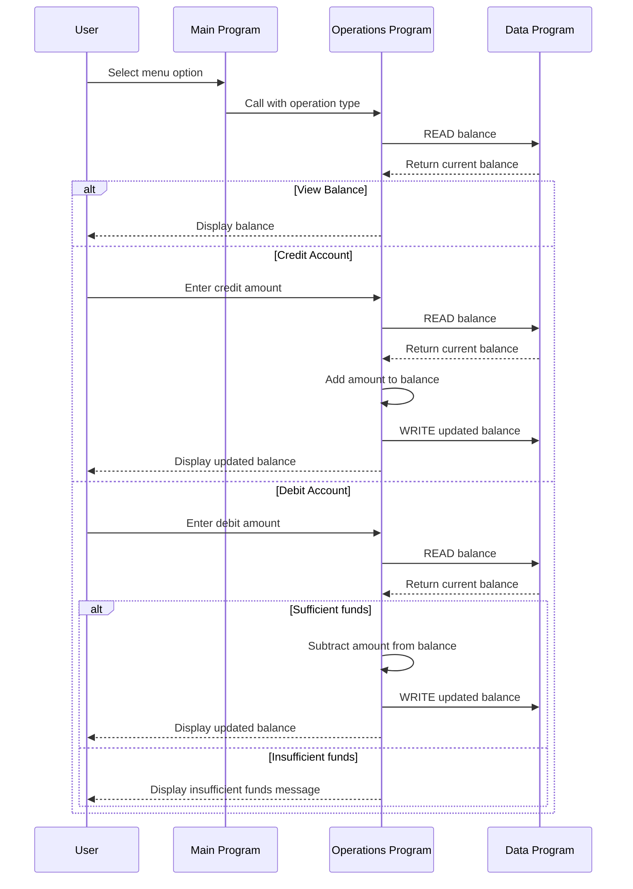

# COBOL Account Management Documentation

This directory documents the COBOL account management application in this repository. The current implementation models a simple student account balance workflow with menu-driven operations for viewing, crediting, and debiting an account.

## Overview

The application is split into three COBOL programs:

- Main program: presents the user interface and routes actions
- Operations program: performs balance-related actions
- Data program: stores and returns the current balance

## File Purpose and Key Functions

### 1. src/cobol/main.cob
Purpose:
- Acts as the main entry point for the application.
- Presents the user with a menu for account operations.
- Routes the user’s selection to the operations program.

Key functions:
- Displays the account menu options: view balance, credit, debit, and exit.
- Accepts user input from the console.
- Calls the Operations program for the selected action.
- Keeps the application running until the user chooses to exit.

### 2. src/cobol/operations.cob
Purpose:
- Implements the business logic for account transactions.
- Handles balance inquiries, credits, and debits.

Key functions:
- Reads the current balance from the data program.
- Displays the current balance when the user requests a balance check.
- Allows the user to enter a credit amount and updates the balance.
- Allows the user to enter a debit amount and subtracts it if funds are sufficient.
- Rejects debit requests when the available balance is too low.

### 3. src/cobol/data.cob
Purpose:
- Stores the account balance value used by the application.
- Provides a simple persistence layer for the current balance.

Key functions:
- Stores an initial balance of 1000.00.
- Supports a READ operation to return the current balance.
- Supports a WRITE operation to update the stored balance.

## Business Rules for the Student Account

The current COBOL logic enforces the following rules:

1. Initial balance
   - The account starts with a balance of 1000.00.

2. View balance
   - The user can view the current balance at any time.

3. Credit account
   - The user can add funds to the account.
   - The new balance becomes the previous balance plus the credited amount.

4. Debit account
   - The user can withdraw funds from the account.
   - A debit is allowed only if the account has enough funds.
   - If the debit amount exceeds the balance, the system displays an "Insufficient funds" message and does not change the balance.

5. Data persistence
   - The current balance is preserved between operations through the data program.

## Sequence Diagram

## Notes

This repository is a simple legacy COBOL example. The implementation is intentionally straightforward and does not yet include advanced features such as account history, validation for negative amounts, or database-backed storage.
